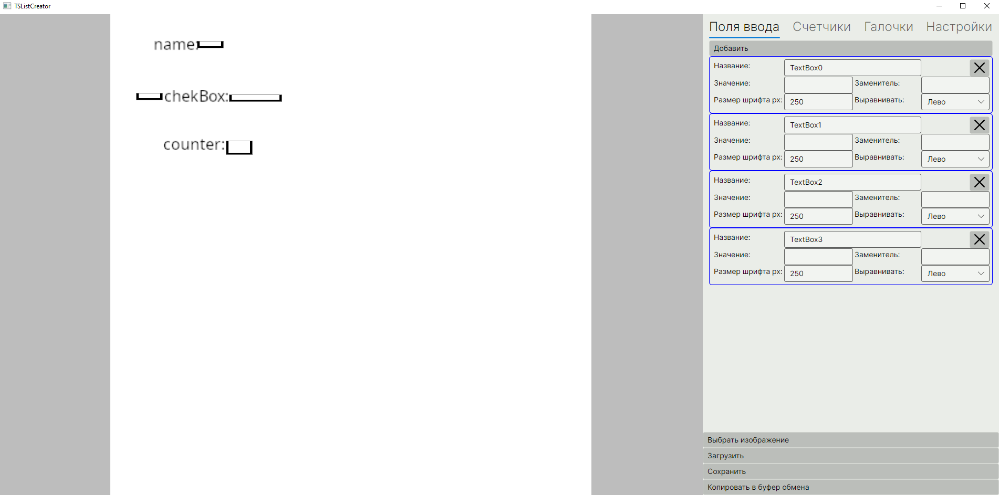
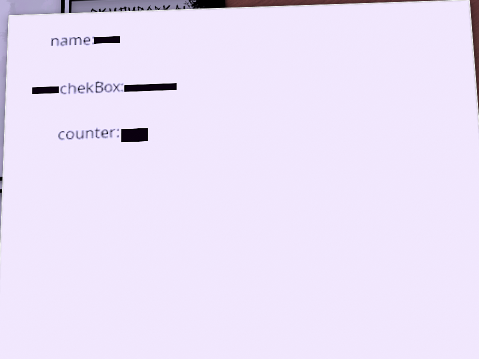

# TsListCreator

**TsListCreator** — это утилита для быстрого и удобного конструирования листов персонажей (character sheets) для Tabletop Simulator. Программа помогает визуально расставлять поля ввода/подписи, настраивать цвета и размеры, а затем экспортировать готовую разметку в формат, который легко вставить в скрипты TTS.

Зачем это нужно

Создавать интерфейс в TTS «вручную» сложно: Приходится долго подбирать параметры руками. Программа показывает, как лист будет выглядеть на столе,
конвертирует положения элементов в нужные координаты, позволяет сохранять/загружать проект и копировать итоговый код в буфер обмена.

Перед началом работы требуется получить границы будущего объекта внутри игры и внести соответсвующие поля x и z в настройках
``` lua
function onLoad()
    local bn = self.getBoundsNormalized()
    print(("Normalized bounds (scale=1): X=%.3f, Y=%.3f, Z=%.3f")
        :format(bn.size.x, bn.size.y, bn.size.z))
end
```
или
``` lua
function onLoad()
    local bn = self.getBoundsNormalized()
    setNotes(("Ширина: %.3f\n Длина: %.3f")
        :format(bn.size.x,  bn.size.z))
end
```
## Пример работы программы


## Вид в игре


Путь к тестовому изображению: TSListCreator.Tests\Images\list.png
Его границы внутри игры: 3.742 и 3.742